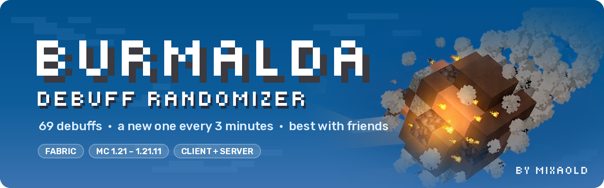

<p align="center">
  
</p>

<p align="center">
  <a href="https://modrinth.com/mod/burmalda"></a>
  <a href="https://github.com/Mixaold/Burmalda/issues"></a>
  <a href="https://www.donationalerts.com/r/mixaold"></a>
</p>

<p align="center">
  <a href="https://modrinth.com/mod/burmalda"></a>
  <a href="https://modrinth.com/mod/burmalda/versions"></a>
  
  
</p>

<p align="center"><b>English</b> · <a href="#русский">Русский</a></p>

---

## About

A debuff randomizer. Every three minutes everyone gets handed something at random — one player flies
off into the sky, another burns, a third just suffers for no reason.

69 debuffs in total: **46 personal** ones and **23 that hit the whole server at once** — a military base
with a commander shouting drill orders, Pandora's box, a drone hunting you down. Some personal ones go
just as far, like an interrogation room built around you while you stand there.

Best played with friends — a lot of the debuffs tie players to each other.

## Screenshots

<table>
  <tr>
    <td width="50%"><br><sub><b>Meteor Storm</b> — one of the group debuffs</sub></td>
    <td width="50%"><br><sub><b>Military Base</b> — a whole army base, with drill commands</sub></td>
  </tr>
  <tr>
    <td width="50%"><br><sub><b>Real randomness</b> — with items and structures</sub></td>
    <td width="50%"><br><sub><b>Wheel of Fortune</b></sub></td>
  </tr>
</table>

## Features

- **A new debuff every 3 minutes** for every player, plus group events for the whole server
- **A panel with timers** on screen, so you always see what you've got and how long it lasts
- **`/burmalda menu`** — hand out debuffs by hand: pick players, search a debuff by name.
  Only the host and whoever is in the whitelist can open it
- **Its own advancements** — survive the Military Base, dodge Shahed strikes, find Pandora's key
- **English and Russian**, everywhere: debuffs, messages, HUD
- **One mod, eleven Minecraft versions** — from 1.21 to 1.21.11

## Install

Needs [Fabric API](https://modrinth.com/mod/fabric-api). Put the jar on **both the client and the
server** — the server runs the debuffs, the client draws the panel and the timers.

Take the jar for your version:

| Jar | Minecraft |
|---|---|
| `burmalda-1.2.0-1.21.1.jar` | 1.21, 1.21.1 |
| `burmalda-1.2.0-1.21.3.jar` | 1.21.2, 1.21.3 |
| `burmalda-1.2.0-1.21.5.jar` | 1.21.4, 1.21.5 |
| `burmalda-1.2.0-1.21.8.jar` | 1.21.6, 1.21.7, 1.21.8 |
| `burmalda-1.2.0-1.21.11.jar` | 1.21.9, 1.21.10, 1.21.11 |

## Start it

Type `start` in chat (or `пошла возня`), then confirm with `burmalda` (or `бурмалда`).

Best to start once everybody has joined, but latecomers get caught up anyway.

## Bugs

[Open an issue](https://github.com/Mixaold/Burmalda/issues). Say which Minecraft version and which jar
you're on, what you were doing and which debuff was running. If the game crashed or kicked you, attach
`.minecraft/logs/latest.log`.

## Build

One source tree, five build targets through Stonecutter:

```
./gradlew :1.21.1:build :1.21.3:build :1.21.5:build :1.21.8:build :1.21.11:build
```

The jars land in `versions/<version>/build/libs/` — the plain one, not `-sources`.

## License

[MIT](LICENSE).

---

<p align="center"><a href="#about">English</a> · <b>Русский</b></p>

## Русский

### О моде

Рандомайзер дебаффов. Каждые три минуты всем выдаётся что-то случайное — кто-то улетает в небо,
кто-то горит, кто-то просто страдает без причины.

Всего 69 дебаффов: **46 личных** и **23 групповых**, которые накрывают весь сервер разом — военная часть
с командиром и его командами, ящик Пандоры, дрон, который за тобой охотится. Личные бывают не слабее:
например, допросная, которую строят прямо вокруг тебя.

Лучше играть с друзьями — куча дебаффов завязана на связки между игроками.

### Что внутри

- **Новый дебафф каждые 3 минуты** для каждого игрока, плюс групповые события на весь сервер
- **Панель с таймерами** на экране — всегда видно, что на тебе висит и сколько ещё
- **`/burmalda menu`** — выдавать дебаффы руками: выбираешь игроков, ищешь дебафф по названию.
  Открыть может только хост и те, кто в вайтлисте
- **Свои ачивки** — пережить Военку, увернуться от Шахедов, найти ключ Пандоры
- **Русский и английский** везде: дебаффы, сообщения, интерфейс
- **Один мод — одиннадцать версий Minecraft**, с 1.21 по 1.21.11

### Установка

Нужен [Fabric API](https://modrinth.com/mod/fabric-api). Ставить jar **и на клиент, и на сервер** —
сервер крутит дебаффы, клиент рисует панель и таймеры.

Бери jar под свою версию:

| Jar | Minecraft |
|---|---|
| `burmalda-1.2.0-1.21.1.jar` | 1.21, 1.21.1 |
| `burmalda-1.2.0-1.21.3.jar` | 1.21.2, 1.21.3 |
| `burmalda-1.2.0-1.21.5.jar` | 1.21.4, 1.21.5 |
| `burmalda-1.2.0-1.21.8.jar` | 1.21.6, 1.21.7, 1.21.8 |
| `burmalda-1.2.0-1.21.11.jar` | 1.21.9, 1.21.10, 1.21.11 |

### Запуск

Пишешь в чат `пошла возня` (или `start`), потом подтверждаешь словом `бурмалда` (или `burmalda`).

Лучше запускать, когда все уже зашли, но и опоздавших мод подхватит.

### Баги

[Пиши в issues](https://github.com/Mixaold/Burmalda/issues). Укажи версию Minecraft и какой jar
стоит, что делал и какой дебафф был активен. Если игру выкинуло или крашнуло — приложи
`.minecraft/logs/latest.log`.

### Сборка

Один исходник, пять сборок через Stonecutter:

```
./gradlew :1.21.1:build :1.21.3:build :1.21.5:build :1.21.8:build :1.21.11:build
```

Готовые jar лежат в `versions/<версия>/build/libs/` — обычный, не `-sources`.

### Лицензия

[MIT](LICENSE).
